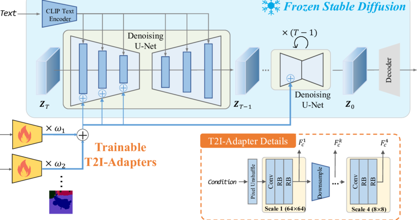

# Text2Image

Architecture

- Get images, captions
- Get random caption
- run through conditioned ddpm unet
- I'm going to need crossattention, probably
- upsample later unet

## Old readme

https://arxiv.org/pdf/2102.12092
https://github.com/openai/guided-diffusion?tab=readme-ov-file

https://scholar.harvard.edu/files/binxuw/files/stable_diffusion_a_tutorial.pdf

- Dataset:

  - Conceptual captions: https://ai.google.com/research/ConceptualCaptions/download (waaaay big, images not included (its links), and some broken links)
  - ✅Flickr30k: https://paperswithcode.com/dataset/flickr30k (might be too small, you need to fill out a form to get the data)
  - ✅Coco captions: https://paperswithcode.com/dataset/coco-captions (just about right size, 25gb, direct dl), 640x480. https://cocodataset.org/#download

- Preprocessing

  - Normalize images, tokenize text
  - Vectorize textual descriptions using gpt, bert, or t5
  - Implemented at ~/Documents/python_programs/huggingface/vectorize_bert.py
  - Is fixed length ✅ (768)
  - Architecture
  - Gan (kinda unstable)
  - Vae (autoencoder) (?)
  - Diffusion (DDPM?) (speed should not be an issue with new computer)
  - Ddpm takes a noise vector (noise image) and iteratively denoises it
  - For text to image, the neural network gets inputted both the image and the embedded prompt.
  - Specification of the nn:
  - U-net architecture: image goes down, image goes up, skip connections BUT with the skip connections, the prompt is injected throughout.
  - See https://en.wikipedia.org/wiki/Diffusion_model#Choice_of_architecture
  - We dont need those weird “t2i adapters”
    

- Train
  - Get text, tokenize, vectorize (bert), run through model (iteratively, ~20 steps, implement in the forward function), compare generated image with ground truth image
  - All the classic stuff such as printing images every epoch and checkpoints
  - Nuance: print over the course of iterations: for each epoch, for each image, print at it iteration 1,5,10,15,20
  - Hyperparameter tuning
  - Essentially step 4 with many different hyperparameter configurations, make sure to have train/test/val
- Running
  - Get text, vectorize (bert), then run thru model

okay heres how stable diffusion works
theres this VAE, and it learns to put big images as 3x64x64 latent space
train that, and THEN start with your diffusion model
You do your iterative denoising with the following model:
half of vae compresses down, unet with resnet architecture, half of vae compresses up
prompt is concatenated in the latent space
